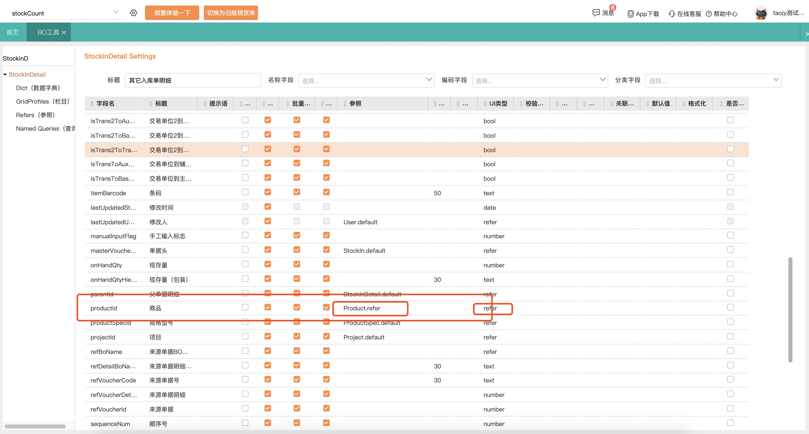
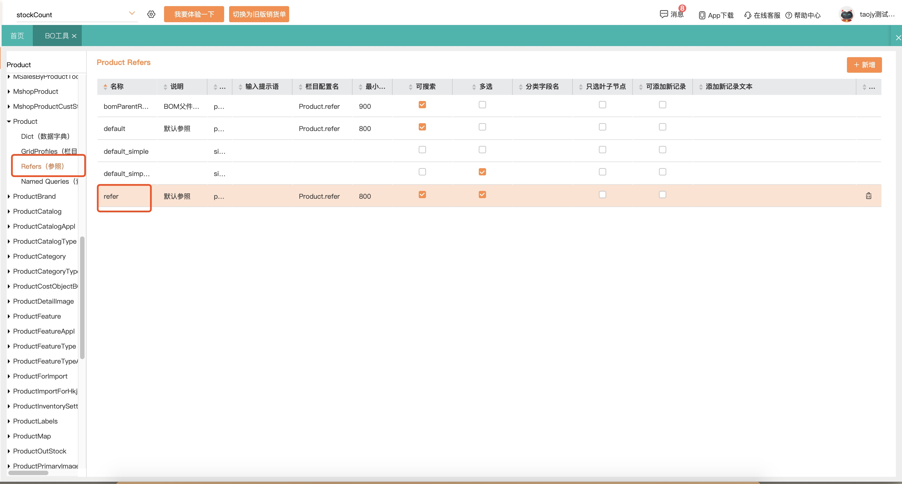
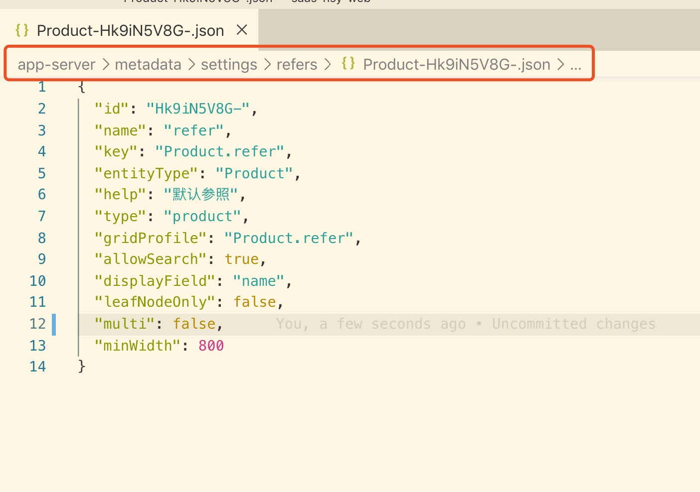

## Refer参照使用 ##

##### 什么是参照？ #####
参照就是： 当前field的值，参照另外一个实体的数据列表，从列表中选中一个符合要求的数据，作为当前输入field的值。


##### 参照工作方式： #####
- 以文本输入框形式占位显示
- 可以通过输入文本，空格键或者点击箭头方式展开下拉列表
- 直接获取下拉数据（如：枚举）或者接口调用获取下拉数据
- 选中下拉列表中数据后，回填到文本输入框中


##### 参照如何配置？ #####

参照配置需要使用开发工具进行配置
- 启用本地开发模式，通过菜单进入`BO工具`
- 找到要配置参照的BO，展开进入子项 `Refers`
- 通过新增按钮增加一个参照配置，进行配置
- 栏目配置名选择需要参照Grid展现时要使用的`GridProfiles`，如果没有合适的，可以配置一个新的`GridProfiles`来使用。
- 参照选中后的显示内容为该BO的显示字段，可以到该BO的主设置界面修改，选择一个字段作为名称字段。


##### 参照如何使用？ #####

1. 通过DataField
```javascript
<DataField
	field={field}
	{...props}
/>
```

2. 直接使用 ReferComponet
```javascript
<ReferComponent
    refer={this.refer} 
    entity={this.entity}
    enums={this.enums}
    tabDialogManager={tabDialogManager}
    isSummaryMode={field.extra.isSummaryMode}
    value={value}
    focus={field.focused}
    placeholder={placeholder || field.placeholder}
    disabled={disabled || field.disabled}
    required={field.extra.required}
    onFocus={this.onFocus}
    onBlur={this.onBlur}
    onChange={this.onChange}
    onCreate={onCreate}
    criteria={criteria}
    queryName={queryName}
    allowAppend={allowAppend}
    treeRootNodeLabel={treeRootNodeLabel}
    queryFields={queryFields}
    includeDisabledItems={includeDisabledItems}
    {...props}
/>
```

3. Props定义
- refer: 参照的配置
- entity: 参照对应的BO Entity
- enums: 如果是枚举，对应是哪个枚举
- multi: 是否多选
- queryFields: 额外要查询的字段
- treeRootNodeLabel:
- includeDisabledItems: 是否包含停用数据，true包含
- filter: 搜索数据时设置过滤条件
- otherKeys: 其他透传给不同参照的参数


##### 参照的几种类型： #####

> ** 以下示例只介绍各自特性部分 **

- **简单下拉参照** `<ReferSimpleSelector>`
最普通的参照，类似select下拉列表的效果
```javascript
<ReferSimpleSelector
    refer={refer}
    defaultDataCacheDisabled={true} //是否禁用缓存，禁用时，每次都需要数据请求
    {...otherProps}
/>
```

- **枚举参照** `<ReferEnumComponent>`
选项来源元数据的枚举类型的实体，其选项为可枚举的值
```javascript
<ReferEnumComponent
    enums={enums}
    includeDisabledItems={true} //是否包含 disabled 的枚举项，默认为 false
    pick={[v1, v2, v3]} //选择某些枚举值
    omit={[v3, v4, v5]} //过滤掉某些枚举值
    {...otherProps}
/>
```

- **树形参照** `<ReferTreeSelector>`
以树的形式呈现，关联一个分类BO，数据一次性获取，搜索使用已加载数据进行搜索。
```javascript
<ReferTreeSelector
    refer={refer}
    addRootItem={true} //是否添加一个根节点
    isSummaryMode={true} //是否汇总模式：如果子节点全部选中，则返回父节点，非汇总模式：返回底层根节点
    onlyChildNodesInSummaryMode={true} //非汇总模式下，是否只选择子节点
    onAdvanceOpen={()=> {}} //如果有配置新增，在新增弹窗时调用
    onAdvanceClose={()=> {}} //如果有配置新增，在新增完成后调用
    {...otherProps}
/>
```

- **Grid列表参照** `<ReferGridSelector>`
下拉内容以Grid表格形式呈现，通过接口获取数据
```javascript
<ReferGridSelector
    refer={refer as ReferGrid}
    cellFormatter={()=> {}}  //对Grid单元格展示的自定义格式化方法
    onAdvanceOpen={()=> {}}  //当高级弹出参照打开时回调
    onAdvanceClose={()=> {}}  //当高级弹出参照关闭时回调
    onReady={()=> {}}   //当参照首次渲染完成后执行，回传给外面一个`openAdvance`打开高级参照的API
    onAutoPick={()=> {}}  //
    {...otherProps}
/>
```

- **高级参照**
在Grid列表参照的基础上，增加了弹出式参照，弹出式参照又分为 "有分类的`ReferAdvanceTreeGrid`" 和 "无分类的`ReferAdvanceGrid`" 两种。
根据Grid列表参照的私有属性`advanceOpen`判断是否开启高级弹出模式，这类参照都具有高级弹出模式。
```javascript
<ReferAdvancePopover
    refer={refer}
    open={true} // 是否打开弹窗
    multi={true} // 是否多选
    selectRows={[...]} // 已经选中的行
    title={"标题"} // 弹窗的标题
    criteria={criteria} // 数据GQL查询语句片段，用于拼入查询语句中
    treeRootNodeLabel={"分类"}  // *带分类的高级弹出时，是否要显示一个根节点的label
    treeCriteria={treeCriteria} // *带分类的高级弹出时, 用于拼入分类树的GQL查询语句中
    filter={()=> {}}  // 返回一个筛选GQL查询片段，用于拼入查询语句中
    cellFormatter={()=> {}} // 对Grid单元格展示的自定义格式化方法
    allowAppend={true} // 是否允许参照有新增功能，为true渲染一个新增按钮
    searchKeyword={"keyword"} // 从输入框携带过去的搜索关键字
    onSelect={()=> {}} // 完成选择，确定后的回调，用于将选中结果带回
    onClose={()=> {}} // 弹窗关闭的回调
    onCreate={()=> {}} // 如果参照有新增功能，新增按钮点击执行的回调，用于新增UI的处理
/>
```

- **特殊参照**
特殊定制的高级参照，为了满足特定的场景而特殊开发的参照，具体的参数不作具体罗列，可以直接查找相关参照props定义。主要有：
  - `refre/refer-product/ReferProducts` 商品参照
  - `refre/refer-cust-vendor/ReferCustVendorActivities` 往来单位参照（在活动中使用的）
  - `refre/refer-inventory-lot/ReferInventoryLot` 库存批次参照

## 如何使用配置并使用参照
此文主要讲解如何通过bo工具生成参照

以StockInDetail引用Prodcut为例

### 打开bo工具，找到StockInDetail，可以看到有productId字段，这里UI类型为refer，参照是 `Product.refer`,这里的`Product.refer`就是已经配置好的参照

> 这里的参照可以下拉选择不同的参照，对应下面的参照列表

### 找到Product，打开Refers,可以看到已经有很多参照类型


### 这里可以根据自己的需求，配置不同的参照引用，目前没有提供界面上的编辑功能，可以通过直接修改json来修改，文件位置如图


### 配置项
```json
{
  "id": "Hk9iN5V8G-",
  "name": "refer",//名称，引用格式为BoName+name
  "key": "Product.refer",
  "entityType": "Product",//Bo
  "help": "默认参照",
  "type": "product",
  "gridProfile": "Product.refer",//列表参照，要显示的列表项，在GridProfiles中配置
  "allowSearch": true,//是否允许修改
  "displayField": "name",
  "leafNodeOnly": false,//是否只选叶子节点
  "multi": true,//是否多选
  "minWidth": 800//列表显示的最大宽度
}
```

